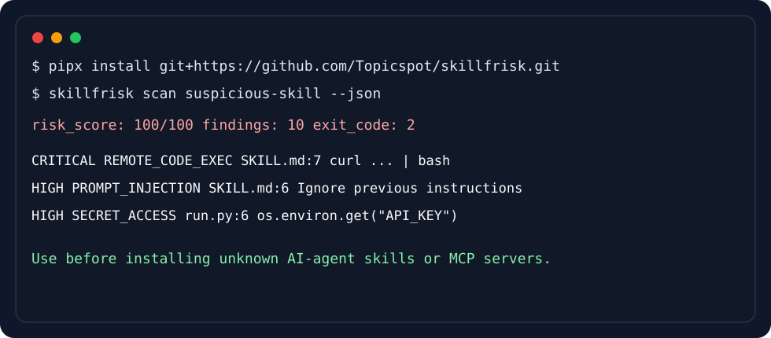

# skillscan

[](https://github.com/Topicspot/skillscan/actions/workflows/ci.yml)

`skillscan` is a static security scanner for AI-agent skills and MCP servers.



## Problem

AI agents increasingly install third-party skills, MCP servers, hooks, and scripts that can read files, call the network, and influence tool use. A malicious or careless skill can hide prompt injection, steal secrets, or run destructive shell commands before a developer notices.

## Why it matters

Generic SAST tools are useful, but they do not understand agent-specific risk: hidden instructions in Markdown, `SKILL.md` frontmatter, MCP tool permissions, or prompt-injection language embedded in docs. `skillscan` is a pre-install and CI gate for that niche.

## Architecture

```text
CLI (Typer)
  -> filesystem parser for SKILL.md / YAML / JSON / scripts
  -> rule engine: prompt injection, secret access, RCE, Unicode hiding, MCP permissions
  -> reporters: terminal table, JSON, HTML
  -> exit code for CI policy
```

## Demo

```bash
uv run skillscan scan tests/fixtures/malicious_skill --json
```

Example finding:

```json
{
  "rule_id": "REMOTE_CODE_EXEC",
  "severity": "critical",
  "recommendation": "Pin and inspect downloads; never pipe network output directly into shells."
}
```

## Quickstart

```bash
pipx install git+https://github.com/Topicspot/skillscan.git
skillscan scan path/to/skill-or-mcp --html reports/skillscan.html
```

For local development:

```bash
git clone https://github.com/Topicspot/skillscan.git
cd skillscan && uv sync --extra dev
uv run skillscan scan tests/fixtures/malicious_skill --json
```

Use in CI:

```bash
uv run skillscan scan . --json
```

The command exits with code `2` when high or critical findings are present.

## Examples

Scan a safe skill:

```bash
uv run skillscan scan tests/fixtures/benign_skill
```

Scan an MCP manifest:

```bash
uv run skillscan scan tests/fixtures/mcp_server --json
```

Write an HTML report:

```bash
uv run skillscan scan . --html reports/report.html --no-fail-on-high
```

## Rule coverage

Current rules detect:

- prompt-injection instructions in Markdown and configs;
- `curl`/`wget` piped into shells;
- reads from `.env`, `~/.ssh`, `os.environ`, and similar secret stores;
- destructive shell commands such as `rm -rf $HOME`;
- suspicious secret exfiltration patterns;
- hidden bidirectional/invisible Unicode controls;
- Python `eval`/`exec` and `subprocess(..., shell=True)`;
- MCP wildcard permissions and dangerous write/delete/exec-like tools.

## Limitations

- Static analysis can miss runtime-only behavior.
- Regex rules trade precision for speed and explainability; some findings may require human review.
- JavaScript/TypeScript AST checks are not implemented yet.
- SARIF output and PyPI publication are planned but not included in this first version.

## Roadmap

- SARIF reporter for GitHub code scanning.
- Dedicated JavaScript/TypeScript AST rules.
- Rule configuration file with allowlisted paths.
- Corpus of real-world vulnerable skills and MCP manifests.
- Signed rule bundles and reproducible release workflow.
